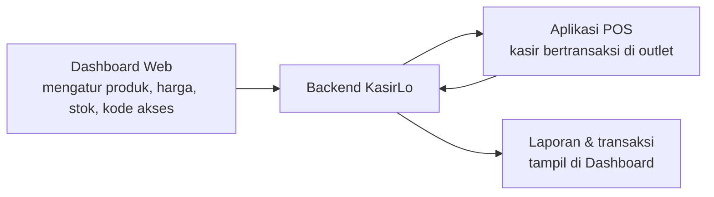

# Tentang KasirLo

**KasirLo** adalah aplikasi kasir (POS) untuk toko, minimarket, kedai kopi, restoran, dan bisnis retail. KasirLo terdiri dari **dua aplikasi** yang saling terhubung:

## Aplikasi POS (Mobile)

Dijalankan di HP atau tablet oleh kasir di outlet. Aplikasi ini dipakai saat transaksi langsung dengan pelanggan.

- Login dengan **Kode Akses Kasir** lalu **PIN 6 digit** (tanpa email/password).
- Wajib **membuka shift** sebelum mulai bertransaksi.
- Katalog produk, scan barcode, keranjang, diskon, tipe pesanan, dan pembayaran.
- Cetak struk ke **printer thermal** (Wi-Fi, Bluetooth, atau USB).
- Menu utama: **POS**, **Shift**, **Transaksi**, **Profil**.

## Dashboard (Back Office)

Dijalankan di browser dari komputer oleh pemilik toko, admin, atau manager. Aplikasi ini dipakai untuk mengatur bisnis dari balik layar.

- **Manajemen Produk & Stok** — produk master dan harga/stok per outlet.
- **Kelola Toko** — cabang, karyawan, kode akses kasir, shift, peran staff, metode pembayaran, pajak, dan template struk.
- **Laporan, Transaksi, Pengeluaran, dan Pelanggan**.

<Callout type="info" title={'Istilah "outlet"'}>
  "Outlet" adalah cabang atau lokasi toko Anda (misal: "Kopi Senja — Tebet"). Satu akun bisa memiliki banyak outlet, dan tiap outlet bisa punya stok, harga, shift, dan kode akses kasirnya sendiri.
</Callout>

## Cara kedua aplikasi bekerja bersama

1. Pemilik menyiapkan bisnis di **Dashboard**: menambah outlet, produk, harga & stok, metode pembayaran, pajak, dan **kode akses kasir**.
2. Kasir membuka **Aplikasi POS**, masuk dengan kode akses + PIN, membuka shift, lalu mulai bertransaksi.
3. Setiap transaksi tersimpan otomatis dan bisa dilihat di **Dashboard** (Riwayat Transaksi, Laporan, Pengeluaran).

## Mulai dari mana?

| Jika Anda ingin... | Lihat panduan |
|---|---|
| Membuat akun baru | [Pendaftaran & Login](/getting-started/register-login) |
| Menyiapkan toko pertama | [Menyiapkan Toko Pertama](/getting-started/setup-first-store) |
| Belajar bertransaksi di kasir | [Login Kasir](/pos-app/login-cashier) dan [Membuat Transaksi](/pos-app/create-transaction) |
| Mengatur produk & stok | [Manajemen Produk](/products/manage-products) |
